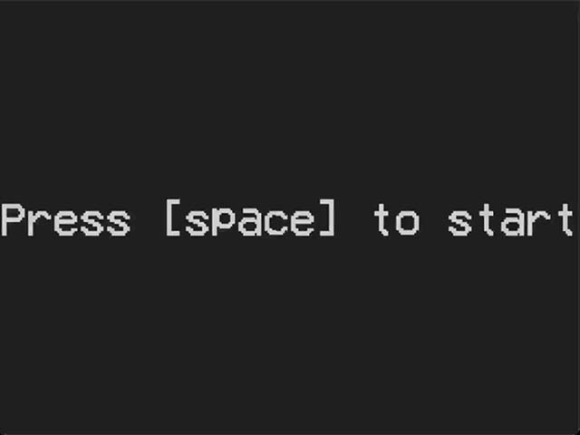
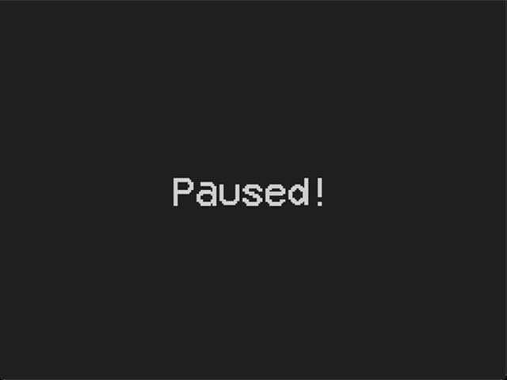
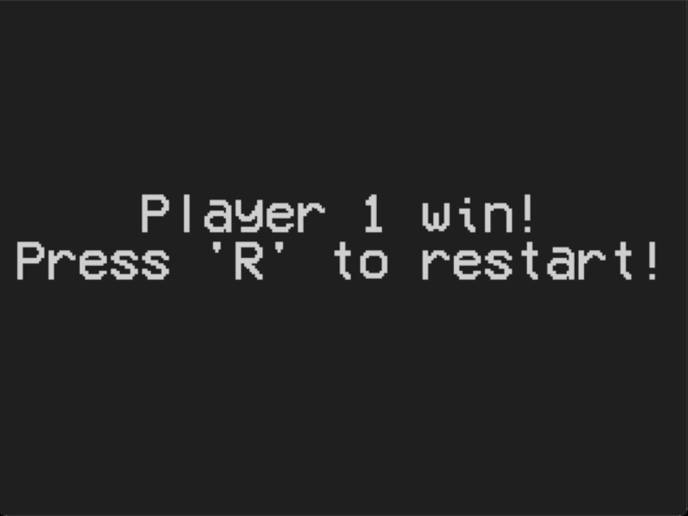

# SDL Pong

## Introduction

A classic pong game made using SDL and C++ for practicing C++ as well as making game logics and functions.

## SDL Extensions

Along with the [SDL library](https://github.com/libsdl-org/SDL), the project also uses some SDL extensions. They are:

-   [SDL_ttf](https://github.com/libsdl-org/SDL_ttf0
-   [SDL_image](https://github.com/libsdl-org/SDL_image)
-   [SDL_mixer](https://github.com/libsdl-org/SDL_mixer)

## Game Assets

While the game objects such as the ball and paddles were created using the SDL function for rendering filled rectangle, the text font and sound effects were downloaded from the free-to-use sources.

-   Font: [VCR_OSD_MONO](https://www.dafont.com/vcr-osd-mono.font)
-   Sound Effects: [opengameart.org](https://opengameart.org/content/3-ping-pong-sounds-8-bit-style)

## Output

### Start Screen

### Gameplay

### Pause Screen

### Player Win Screen

